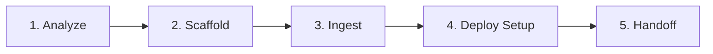

# astro-docs

Scaffold and maintain **Astro-based documentation sites** with **GitHub Pages deployment**.

## Purpose

Provide documentation site management using Astro (modern static site generator):
1. Scaffold Astro documentation project from template
2. Ingest content from existing markdown sources
3. Generate navigation from project structure
4. Create GitHub Actions workflow for deployment
5. Produce maintenance guide for ongoing updates

## Why Astro?

| Feature | Astro | MkDocs |
|---------|-------|--------|
| **Performance** | Zero JS by default, partial hydration | Full page loads |
| **Flexibility** | Component islands, multiple frameworks | Python-only |
| **Modern DX** | TypeScript, Tailwind, hot reload | YAML config |
| **Ecosystem** | npm packages, integrations | Python packages |
| **Hosting** | Any static host, Vercel, Netlify | GitHub Pages, RTD |

**Use Astro when:**
- Project already uses Node.js/npm
- Need interactive components in docs
- Want modern tooling (TypeScript, Tailwind)
- Building consumer-facing documentation

**Use MkDocs when:**
- Project is Python-only
- Team prefers simpler YAML-based config
- Already using MkDocs

## When to Use

- Setting up documentation for a Node.js/TypeScript project
- Migrating from MkDocs to Astro
- Need interactive documentation components
- Want modern static site generation

## CRITICAL: No Assumptions

> **NEVER assume. NEVER guess. ALWAYS ask.**

**Before scaffolding, confirm with user:**

| If unclear about... | ASK |
|---------------------|-----|
| Output location | "Where should I create the Astro site? (default: `docs/astro-docs/`)" |
| Site name/title | "What should the documentation site be called?" |
| Base path | "What base path for GitHub Pages? (e.g., `/project-name/`)" |
| Content sources | "Which folders contain documentation? (default: README, docs/, specs/)" |

## Workflow Overview



## Phase 1: Analyze & Plan

**Discover documentation-relevant content:**

1. **Check for existing MkDocs**
   ```bash
   # If mkdocs.yml exists, offer migration
   if [[ -f "mkdocs.yml" ]]; then
       echo "MkDocs detected. Options:"
       echo "1. Migrate content to Astro"
       echo "2. Keep both (different output paths)"
       echo "3. Cancel and keep MkDocs"
   fi
   ```

2. **Invoke `context-map`** to understand project structure
3. **Invoke `project-sections`** to identify documentation sources
4. **Scan for content:**
   - `README.md` → Overview page
   - `project docs` → Guide pages
   - `project docs` → Specification pages
   - `docs/**/*.md` → Existing documentation

**Output:**
```
📋 Documentation Analysis:

Content Sources Found:
- README.md (2,145 words)
- docs/ (5 files)
- specs/ (3 files)
- docs/ (12 files, includes mkdocs.yml)

Recommendation: Migrate docs/ content to Astro, archive mkdocs.yml

Proceed? [Y/n]
```

## Phase 2: Scaffold Astro Project

**Create minimal Astro docs project:**

### Directory Structure

```
{output_path}/
├── astro.config.mjs
├── package.json
├── tsconfig.json
├── public/
│   └── favicon.svg
└── src/
    ├── components/
    │   ├── Header.astro
    │   ├── Sidebar.astro
    │   └── Footer.astro
    ├── layouts/
    │   ├── BaseLayout.astro
    │   └── DocsLayout.astro
    ├── pages/
    │   ├── index.astro
    │   └── [...slug].astro
    ├── content/
    │   ├── config.ts
    │   └── docs/
    │       ├── getting-started/
    │       ├── guides/
    │       ├── reference/
    │       └── about/
    └── styles/
        └── global.css
```

### package.json Template

```json
{
  "name": "{site-name}-docs",
  "type": "module",
  "version": "0.0.1",
  "scripts": {
    "dev": "astro dev",
    "start": "astro dev",
    "build": "astro check && astro build",
    "preview": "astro preview",
    "astro": "astro"
  },
  "dependencies": {
    "astro": "^4.10.0",
    "@astrojs/check": "^0.7.0"
  },
  "devDependencies": {
    "typescript": "^5.4.0"
  }
}
```

### astro.config.mjs Template

```javascript
import { defineConfig } from 'astro/config';

export default defineConfig({
  site: '{site_url}',
  base: '{base_path}',
  integrations: [],
  markdown: {
    shikiConfig: {
      theme: 'github-dark',
      wrap: true
    }
  }
});
```

### Content Collection Config (src/content/config.ts)

```typescript
import { defineCollection, z } from 'astro:content';

const docsCollection = defineCollection({
  type: 'content',
  schema: z.object({
    title: z.string(),
    description: z.string().optional(),
    order: z.number().optional(),
    draft: z.boolean().optional().default(false),
  }),
});

export const collections = {
  docs: docsCollection,
};
```

## Phase 3: Content Ingestion

**Transform existing content into Astro pages:**

### Frontmatter Transformation

Add required frontmatter to ingested markdown:

```markdown
---
title: "Page Title"
description: "Brief description"
order: 1
---

# Original Content

...
```

### Content Mapping

| Source | Destination | Section |
|--------|-------------|---------|
| `README.md` | `src/content/docs/index.md` | Home |
| `project docs` | `src/content/docs/guides/` | Guides |
| `project docs` | `src/content/docs/reference/` | Reference |
| `CHANGELOG.md` | `src/content/docs/about/changelog.md` | About |
| `CONTRIBUTING.md` | `src/content/docs/about/contributing.md` | About |

### Navigation Generation

Generate sidebar navigation from content structure:

```typescript
// src/lib/navigation.ts
export const navigation = [
  {
    title: 'Getting Started',
    links: [
      { title: 'Overview', href: '/' },
      { title: 'Installation', href: '/getting-started/installation' },
      { title: 'Quick Start', href: '/getting-started/quickstart' },
    ],
  },
  {
    title: 'Guides',
    links: [
      // Auto-generated from src/content/docs/guides/
    ],
  },
  // ...
];
```

## Phase 4: GitHub Pages Setup

**Create deployment workflow:**

### .github/workflows/docs-astro.yml

```yaml
name: Deploy Documentation (Astro)

on:
  push:
    branches: [main]
    paths:
      - '{output_path}/**'
      - '.github/workflows/docs-astro.yml'
  workflow_dispatch:

permissions:
  contents: read
  pages: write
  id-token: write

concurrency:
  group: "pages"
  cancel-in-progress: true

jobs:
  build:
    runs-on: ubuntu-latest
    steps:
      - name: Checkout
        uses: actions/checkout@v4
      
      - name: Setup Node
        uses: actions/setup-node@v4
        with:
          node-version: '20'
          cache: 'npm'
          cache-dependency-path: '{output_path}/package-lock.json'
      
      - name: Install dependencies
        working-directory: {output_path}
        run: npm ci
      
      - name: Build site
        working-directory: {output_path}
        run: npm run build
      
      - name: Upload artifact
        uses: actions/upload-pages-artifact@v3
        with:
          path: '{output_path}/dist'

  deploy:
    environment:
      name: github-pages
      url: ${{ steps.deployment.outputs.page_url }}
    runs-on: ubuntu-latest
    needs: build
    steps:
      - name: Deploy to GitHub Pages
        id: deployment
        uses: actions/deploy-pages@v4
```

## Phase 5: Handoff

**Create maintenance documentation and stage changes:**

### 1. Generate Maintenance Guide

Create `project docs`:

```markdown
# Astro Documentation Maintenance Guide

## Quick Commands

```bash
cd {output_path}
npm run dev      # Start dev server (localhost:4321)
npm run build    # Build for production
npm run preview  # Preview production build
```

## Adding New Pages

1. Create markdown file in `src/content/docs/{section}/`
2. Add frontmatter:
   ```yaml
   ---
   title: "Page Title"
   description: "Optional description"
   order: 10  # Optional, for sidebar ordering
   ---
   ```
3. Update navigation if needed

## Deployment

Automatic on push to main. Manual trigger available in GitHub Actions.

## Customization

- Styles: `src/styles/global.css`
- Layout: `src/layouts/DocsLayout.astro`
- Components: `src/components/`
- Config: `astro.config.mjs`
```

### 2. Stage Changes (via git)

```
📁 Files to commit:

{output_path}/
├── astro.config.mjs
├── package.json
├── tsconfig.json
├── public/
├── src/
└── ...

.github/workflows/docs-astro.yml

docs/astro-docs-maintenance.md

Commit message: "docs: scaffold Astro documentation site"

Stage and commit? [Y/n]
```

## MkDocs Migration

If `mkdocs.yml` exists, offer migration path:

### Migration Steps

1. **Extract content** from MkDocs `docs/` folder
2. **Transform** markdown files:
   - Add Astro frontmatter
   - Convert MkDocs-specific syntax (admonitions → components)
   - Update internal links
3. **Archive** old MkDocs files:
   - Rename `mkdocs.yml` → `mkdocs.yml.archived`
   - Keep `docs/` if needed for other purposes
4. **Update** GitHub Actions workflow

### Syntax Conversion

| MkDocs | Astro |
|--------|-------|
| `!!! note "Title"` | `<Note title="Title">` |
| `!!! warning` | `<Warning>` |
| `=== "Tab 1"` | `<Tabs><Tab label="Tab 1">` |
| `:material-icon:` | Custom component or emoji |

## Templates

### Basic Page Template

```astro
---
// src/pages/example.astro
import DocsLayout from '../layouts/DocsLayout.astro';
---

<DocsLayout title="Example Page">
  <h1>Example Page</h1>
  <p>Content goes here.</p>
</DocsLayout>
```

### DocsLayout Template

```astro
---
// src/layouts/DocsLayout.astro
import BaseLayout from './BaseLayout.astro';
import Sidebar from '../components/Sidebar.astro';

interface Props {
  title: string;
  description?: string;
}

const { title, description } = Astro.props;
---

<BaseLayout title={title} description={description}>
  <div class="docs-container">
    <Sidebar />
    <main class="docs-content">
      <slot />
    </main>
  </div>
</BaseLayout>
```

## Dependencies Management

### Recommended Integrations

```bash
# Tailwind CSS (optional)
npx astro add tailwind

# MDX support (optional)
npx astro add mdx

# Sitemap (recommended)
npx astro add sitemap
```

### Version Compatibility

| Package | Version | Notes |
|---------|---------|-------|
| astro | ^4.10 | Core framework |
| @astrojs/check | ^0.7 | TypeScript checking |
| typescript | ^5.4 | Type safety |

## Validation

Before deployment, validate:

1. **Build succeeds**: `npm run build`
2. **No 404s**: Check all internal links
3. **Content renders**: Preview all pages
4. **Mobile-friendly**: Test responsive layout
5. **Accessibility**: Check heading hierarchy, alt text

## Integration with Other Skills

| Skill | Integration |
|-------|-------------|
|  | Content source for documentation |
| `versioning` | Changelog page generation |
| `git` | Commit and stage changes |
|  | Include docs build in validation |

## Troubleshooting

### "Cannot find package 'astro'"

```bash
cd {output_path}
npm install
```

### "Build failed: Content collection error"

Check frontmatter schema matches `src/content/config.ts`.

### "GitHub Pages 404"

1. Verify `base` in `astro.config.mjs` matches repository name
2. Check GitHub Pages is enabled in repository settings
3. Ensure workflow completed successfully

### "Images not loading"

1. Place images in `public/` folder
2. Reference with absolute path: `/images/example.png`

### "Styles not applying"

1. Check `src/styles/global.css` is imported in layout
2. Verify no CSS module conflicts
