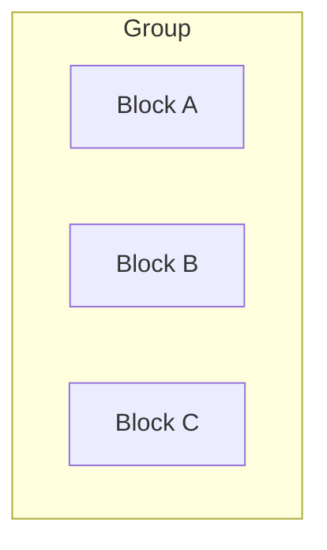
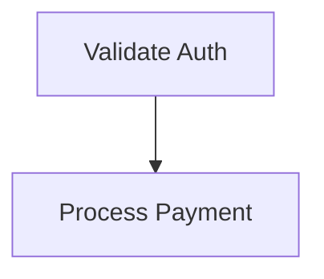
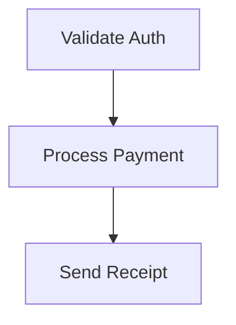

# mermaid

GitHub-compatible Mermaid diagram authoring rules. GitHub uses an older/restricted Mermaid renderer with a fixed-width SVG container — follow these constraints to avoid broken or unreadable diagrams.

**Tier:** 3 (Utility)

---

## GitHub Mermaid Compatibility Rules

### 1. Chart type restrictions

Never use `block-beta` — GitHub doesn't fully support it. Use `flowchart` with `subgraph` blocks instead.

Stick to well-supported types: `flowchart`, `classDiagram`, `sequenceDiagram`, `stateDiagram-v2`, `erDiagram`.

```text
%% BAD — will not render on GitHub
block-beta
  columns 3
  a["Block A"] b["Block B"] c["Block C"]
```



### 2. Keep node labels short

GitHub renders Mermaid in a fixed-width container. Long labels cause the chart to scale down, making everything tiny and unreadable.

- Max ~3-4 short words per label. If you need more detail, put it in a table below the chart.
- Never put multi-line descriptions inside node labels. Use the chart for structure, use a table for detail.

```text
%% BAD — labels too long, chart will be tiny
flowchart TD
  A["Validate user authentication credentials"] --> B["Process payment and update records"]
```



### 3. Horizontal vs vertical orientation

- Use horizontal (`direction LR`) only for 4 or fewer nodes with short labels.
- Use vertical (`direction TB` / `flowchart TD`) for anything with 5+ nodes.
- Charts with many horizontal nodes get squeezed into the fixed-width container and become unreadable.

### 4. No HTML tags in node labels

GitHub's Mermaid sanitizes HTML aggressively. Only `<br>` is reliably supported.

- No `<b>`, `<i>`, `<em>`, `<strong>` — they may break rendering entirely.
- Use `<br>` not `<br/>` — the self-closing form can cause issues.
- No HTML entities (`&lt;`, `&gt;`, `&amp;`) — rephrase to avoid angle brackets.

```text
%% BAD
A["Line one<br/>Line two"]
B["Value &lt; 10"]
C["<b>Important</b>"]

%% GOOD
A["Line one<br>Line two"]
B["Value less than 10"]
C["Important"]
```

### 5. No emoji in node labels

Unicode emoji characters (🔵, ⚡, etc.) can cause edge routing failures in GitHub's renderer. Use plain text only.

```text
%% BAD
A["⚡ Fast Process"]

%% GOOD
A["Fast Process"]
```

### 6. Avoid parentheses in node labels

Parentheses inside `["..."]` labels can confuse the Mermaid parser. Rephrase or remove them.

```text
%% BAD
A["Process (step 1)"]

%% GOOD
A["Process - step 1"]
```

### 7. Pattern: chart + table

For charts that need to convey detail, use the chart for relationships/flow and a markdown table immediately below for descriptions:

````markdown


| Step | Description |
|------|-------------|
| Validate Auth | Check user credentials against identity provider |
| Process Payment | Charge card, update ledger, handle failures |
| Send Receipt | Email confirmation with transaction details |
````

---

## Checklist

When writing or reviewing Mermaid in Markdown for GitHub:

- [ ] Use `flowchart TD`/`TB`/`LR` — not `block-beta`
- [ ] Keep labels to 3-4 short words max
- [ ] Vertical for 5+ nodes, horizontal only for 4 or fewer short labels
- [ ] Line breaks: `<br>` only (not `<br/>`, not `\n`)
- [ ] No HTML formatting tags (`<b>`, `<i>`, `<em>`, `<strong>`)
- [ ] No emoji in node labels
- [ ] No HTML entities (`&lt;`, `&gt;`, `&amp;`)
- [ ] Avoid parentheses in labels
- [ ] Move detail text to a markdown table below the chart
- [ ] Test rendering at [mermaid.live](https://mermaid.live) before committing
